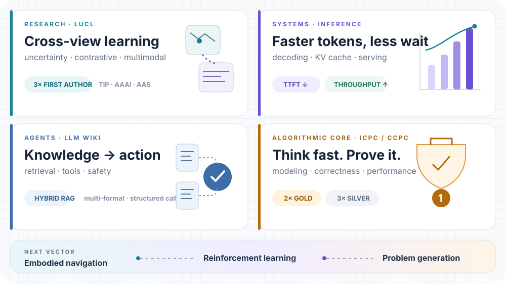

<picture>
  <source media="(prefers-color-scheme: dark) and (max-width: 600px)" srcset="./assets/hero-dark-mobile.svg">
  <source media="(prefers-color-scheme: light) and (max-width: 600px)" srcset="./assets/hero-light-mobile.svg">
  <source media="(prefers-color-scheme: dark)" srcset="./assets/hero-dark.svg">
  
</picture>

  <a href="https://github.com/xjtu-ctgg/LUCL">LUCL</a> ·
  <a href="#details">Details</a> ·
  <a href="https://orcid.org/0009-0008-8462-2494">ORCID</a>

<picture>
  <source media="(prefers-color-scheme: dark) and (max-width: 600px)" srcset="./assets/signal-board-dark-mobile.svg">
  <source media="(prefers-color-scheme: light) and (max-width: 600px)" srcset="./assets/signal-board-light-mobile.svg">
  <source media="(prefers-color-scheme: dark)" srcset="./assets/signal-board-dark.svg">
  
</picture>

<b>Selected details</b> · research, engineering, and awards

 

- **Research** — Three first-author manuscripts in review or revision across IEEE TIP, AAAI, and Acta Automatica Sinica; [LUCL](https://github.com/xjtu-ctgg/LUCL) studies LLM-guided uncertainty contrastive learning for cross-view geo-localization.
- **Inference** — Industry work on speculative decoding, prefix/KV-cache reuse, prompt compression, tool-use evaluation, and high-throughput LLM serving.
- **Agents** — Built a multi-format RAG assistant with hybrid retrieval, reranking, structured tool calls, and safety guardrails.
- **Algorithms** — 2026 ICPC Shaanxi Gold, 2024 CCPC Zhengzhou Gold, and three ICPC/CCPC silver medals; former ACM training-team lead and problem setter.

`C++` · `Python` · `PyTorch` · `Hugging Face` · `Linux` · `Docker`

---

  <b>Build what reasons. Optimize what runs.</b> 
  Foundation models · efficient inference · embodied intelligence · Xi'an, China

