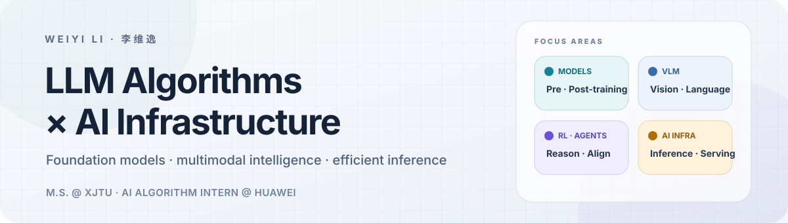

<picture>
  <source media="(prefers-color-scheme: dark) and (max-width: 600px)" srcset="./assets/hero-dark-mobile.svg">
  <source media="(prefers-color-scheme: light) and (max-width: 600px)" srcset="./assets/hero-light-mobile.svg">
  <source media="(prefers-color-scheme: dark)" srcset="./assets/hero-dark.svg">
  
</picture>

  <a href="#selected-work">Selected work</a> ·
  <a href="#research-trajectory">Research trajectory</a> ·
  <a href="#competitive-programming">Competitive programming</a> ·
  <a href="https://orcid.org/0009-0008-8462-2494">ORCID</a>

## Hello, I'm Weiyi

I'm **Weiyi Li (李维逸)**, an M.S. student in Software Engineering at **Xi'an Jiaotong University** and an **AI Algorithm Intern at Huawei**. I bring a competitive-programming foundation to model and systems work across efficient LLM inference, tool-using agents, and multimodal learning.

My research started with cross-view geo-localization. I am now moving toward efficient foundation-model inference and, next, embodied navigation. The thread connecting them is simple: build systems that can **perceive precisely, reason reliably, and run efficiently**.

## Current focus

- **Efficient LLM inference** — decoding and cache efficiency, latency/throughput evaluation, and high-throughput serving.
- **Foundation models & agents** — model training and tuning, RAG, function calling, planner–executor systems, and safe tool use.
- **Embodied intelligence · next** — robot navigation, path planning, reinforcement learning, and algorithmic task generation.

## Selected work

### [LUCL · LLM-guided Uncertainty Contrastive Learning](https://github.com/xjtu-ctgg/LUCL)

First-author research on uncertainty-aware cross-view geo-localization with LLM guidance and attention refinement. The manuscript is under review; code release is planned after the review process.

### LLM inference optimization · industry work

Working on multi-turn LLM inference with an emphasis on decoding efficiency, prefix/KV-cache reuse, prompt compression, and rigorous tool-use evaluation.

### LLM Wiki · RAG agent

Built a multi-format knowledge assistant with hybrid retrieval, reranking, multi-turn query rewriting, structured tool calls, and safety guardrails for document-centric workflows.

## Research trajectory

| Phase | Focus | What I care about |
| :--- | :--- | :--- |
| **Past** | Cross-view geo-localization | Robust retrieval across viewpoints, uncertainty, and multimodal guidance |
| **Now** | Foundation models & inference | Efficient decoding, cache reuse, reliable tool use, and evaluation |
| **Next** | Embodied navigation | Robot planning, reinforcement learning, and decision-making in the physical world |

I have three first-author manuscripts in review or revision across **IEEE TIP**, **AAAI**, and **Acta Automatica Sinica**, centered on cross-view geo-localization and multimodal learning.

## Competitive programming

Competitive programming is where I learned to turn mathematical ideas into fast, correct implementations under pressure.

| Year | Contest | Result |
| :---: | :--- | :---: |
| **2026** | ICPC Shaanxi Provincial Programming Contest | **Gold** |
| **2024** | CCPC National Invitational Contest · Zhengzhou | **Gold** |
| **2025** | ICPC Asia Regional Contest · Xi'an | **Silver** |
| **2023** | ICPC Asia Regional Contest · Shenyang | **Silver** |
| **2023** | CCPC · Guilin | **Silver** |

I also served as an ACM training-team lead and have authored or reviewed problems for university contests, Nowcoder contests, and the Lanqiao Cup.

## Toolbox

**Languages** · `C++` `Python` `Java` 
**Modeling** · `PyTorch` `Hugging Face` `LLM fine-tuning` `RAG` 
**Inference** · `Speculative decoding` `KV cache` `Prefix cache` `Function calling` 
**Systems** · `Linux` `Docker` `Git`

---

  Interested in efficient LLM serving, embodied navigation, and algorithmic problem design. 
  Xi'an, China · <a href="https://orcid.org/0009-0008-8462-2494">ORCID</a>

